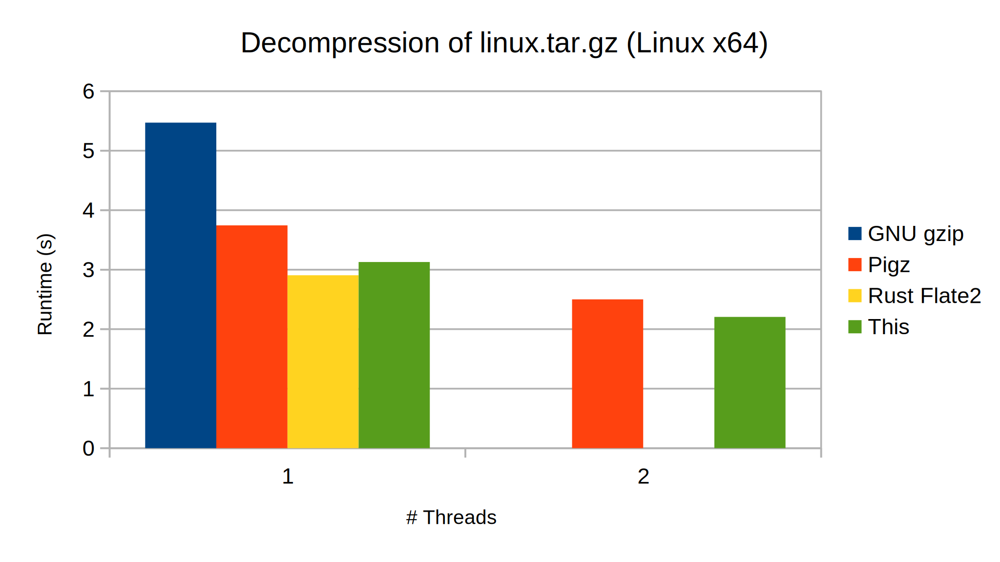

# Gunzip

This repo contains pure Rust implementation of `gunzip` (decompression only) from scratch with ~1000 lines of code for educational purposes. You can check out branches 1 through 14 to understand the code in incremental steps. The current `main` branch is identical to branch 14.

The following roughly summarizes each stage
- branch 1: `main()` function and skeletal structure
- branch 2: `bitread` module for reading bits from a byte stream
- branch 3: `gzip` header & footer for parsing the metadata and checksum
- branch 4: `inflate` for block type 0 (uncompressed) data
- branch 5: `codebook` and `huffman_decoder` modules for decoding Huffman codes
- branch 6: `lz77` and `sliding_window` modules for decompressing LZ77-encoded data
- branch 7: `inflate` for block type 1 and 2 (compressed) data using fixed or dynamic Huffman codes
- branch 8: `checksum_write` module for verifying the decompressed data
- branch 9: performance optimization
- branch 10: multithread support
- branch 11: streaming support
- branch 12: memory optimization
- branch 13: bug fix to reject non-compliant `.gz` file
- branch 14: minor optimization for block type 0

# Features
- written from scratch in pure Rust without unsafe code
- supports streaming, i.e., the decompressor implements `Read` trait
- supports multithreading (two threads)
- competitive in performance with other popular implementations (see [Benchmark](#benchmark) below)

# Library
```rust
use gunzip::Decompressor;

fn main() -> std::io::Result<()> {
    let reader = std::io::stdin();
    let mut writer = std::io::stdout();
    let use_multithread = true;
    let mut decompressor = Decompressor::new(reader, use_multithread);
    std::io::copy(&mut decompressor, &mut writer)?;
    Ok(())
}
```
# Executable
```sh
# Usage: target/release/gunzip [-t]
# 	Decompresses .gz file read from stdin and outputs to stdout
# 	-t: employ two threads

# single thread
$ target/release/gunzip < compressed.gz > decompressed

# two threads
$ target/release/gunzip -t < compressed.gz > decompressed
```

# Benchmark
The following result is obtained by running this [benchmark script](https://gist.github.com/TechHara/500a1f7b8cc08af86856f707c04b0023). To isolate IO bottleneck, the input/output files are placed in a ramdisk.
```sh
# create a ramdisk
mkdir /ramdisk
mount -o size=2G -t tmpfs none /ramdisk
cd /ramdisk

# run benchmark script
curl https://gist.githubusercontent.com/TechHara/500a1f7b8cc08af86856f707c04b0023/raw/ebc3467ac5cfb4f80bac4a0ef0cc042c5b24f27f/gunzip_benchmark.sh | bash
```




# Contributing
You are welcome to contribute by submitting a PR for bug fixes or enhancements. See [here](https://medium.com/@techhara/rust-write-gunzip-from-scratch-1-a0100648b246) for detailed documentations.

# Ports
You can also contribute by porting this code to a different language so that more people can learn from it.
### C++
- [cpp_gunzip](https://github.com/TechHara/cpp_gunzip)
### Go
- [go_gunzip](https://github.com/TechHara/go_gunzip)